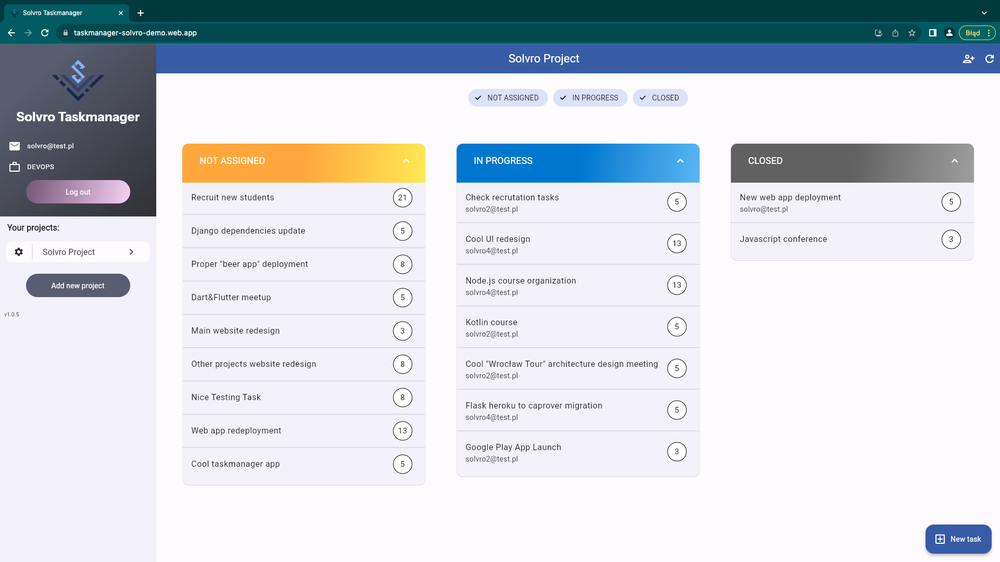

# Taskamanager Demo - zadanie rekrutacyjne Mobile do KN Solvro

---

Link do rekrutacji: https://github.com/Solvro/rekrutacja.zima.2023

Zadanie to prosta aplikacja mobilna we Flutterze do zarządzania zadaniami w zespole developerów. Zintegrowana jest z własnym (za pozwoleniem) api w django,
repo: https://github.com/simon-the-shark/solvro_api_for_mobile  
api url: https://solvro-api-for-mobile.caprover.kowalinski.dev/api
api docs: https://solvro-api-for-mobile.caprover.kowalinski.dev/swagger

Jest to prosty system rejestracji i logowania poprzez maila i hasło, ale autoryzacja odbywa się poprzez tymczasowe tokeny użytkowników.

W aplikacji można tworzyć projekty i zapraszać do nich innych użytkowników. Oczywiście powinny być też wszystkie wymagane funkcjonalności związane z zarządzaniem zadaniami z polecenia.

## Instalacja

Aplikację można samemu skompilować na swoje urządzenie lub zainstalować/przetestować z:

1. apk na androida w releases: https://github.com/simon-the-shark/solvro_mobile/releases/tag/v1.0.7
2. na ios-a mogę zbudować builda specjalnie pod kogoś mac address
3. demo skompilowane do flutter web: https://taskmanager-solvro-demo.web.app/

Zachęcam do przetestowania na przygotowanym przeze mnie projekcie, ale też można się zarejestrować zupełnie od nowa i przetestować na świeżym koncie i projekcie.

# Przykładowe screeny

# Inne Urządzenia

